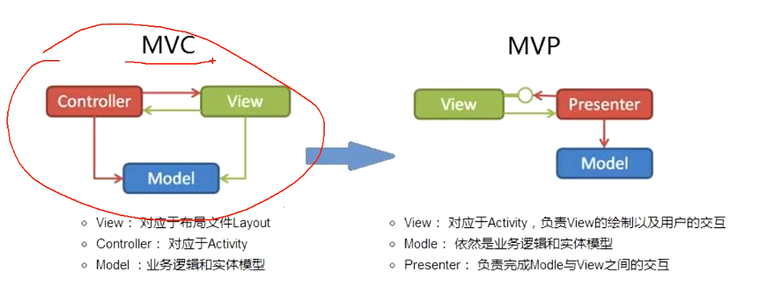

数据，比如网络请求，数据库获取 不在放在activity中，而是放在viewmodel中


room到底用哪个版本？

双向绑定需要继承 BaseObservable


每个activity 都有一个对应的viewmodel


双向绑定指的是xml文件和viewmodel对象

单向绑定是viewmodel被xml绑定

 

```
//通知绑定类去更新试图
notifyPropertyChanged(BR.account);
```

```
@Bindable
public String getAccount() {
    return account;
}
要在提供绑定的get方法上加上@bindable
如果没有加bindalb BR 中就不会生成这个变量
```

代码执行流程是怎样的？


cachedatabase dao 都会自动生成实现类。

真正执行的是实现类


登录结果在activity中的onchange中验证还是在viewmodel中验证呢？

 因为要弹吐司或者其他界面操作，所以选择在onchage中判断。


setvalue 必须在主线程中执行；如果在子线程需要用postvalue。会切换到主线程


# LiveData 

1，LiveData是一个数据持有类

2，能够感知组件的生命周期

3，持有的数据可以被观察者观察


**问题1：onchange回调流程**

**问题2：生命周期流程**


[`LiveData`](https://developer.android.google.cn/reference/androidx/lifecycle/LiveData) 是一种可观察的数据存储器类。与常规的可观察类不同，LiveData 具有生命周期感知能力，意指它遵循其他应用组件（如 Activity、Fragment 或 Service）的生命周期。这种感知能力可确保 LiveData 仅更新处于活跃生命周期状态的应用组件观察者

```java
MutableLiveData<String> liveData = new MutableLiveData<>();
liveData.setValue("zhang");
liveData.postValue("lisi");

postvalue 最终调用的还是setvalue ，只不过是要强制切换到主线程调用
    
        protected void postValue(T value) {
        boolean postTask;
        synchronized (mDataLock) {
            postTask = mPendingData == NOT_SET;
            mPendingData = value;
        }
        if (!postTask) {
            return;
        }
        ArchTaskExecutor.getInstance().postToMainThread(mPostValueRunnable);
    }


    @Override
    public void postToMainThread(Runnable runnable) {
        if (mMainHandler == null) {
            synchronized (mLock) {
                if (mMainHandler == null) {
                    mMainHandler = new Handler(Looper.getMainLooper());
                }
            }
        }
        //noinspection ConstantConditions
        mMainHandler.post(runnable);
    }


setvalue只能在主线程调用，否则报错
        @MainThread
    protected void setValue(T value) {
        assertMainThread("setValue");
        mVersion++;
        mData = value;
        dispatchingValue(null);
    }

    private static void assertMainThread(String methodName) {
        if (!ArchTaskExecutor.getInstance().isMainThread()) {
            throw new IllegalStateException("Cannot invoke " + methodName + " on a background"
                    + " thread");
        }
    }

```


**1，androidx.arch.core.executor; 这里面很多方法可以学习一下**


2，数据保存在哪里呢？

 

## onchange回调流程

```java
liveData.observe(LiveDataActivity.this, new Observer<String>() {
    @Override
    public void onChanged(String s) {
        
    }
});


    @MainThread
    public void observe(@NonNull LifecycleOwner owner, @NonNull Observer<? super T> observer) {
        assertMainThread("observe");
        if (owner.getLifecycle().getCurrentState() == DESTROYED) {
            // ignore
            return;
        }
        LifecycleBoundObserver wrapper = new LifecycleBoundObserver(owner, observer);
        ObserverWrapper existing = mObservers.putIfAbsent(observer, wrapper);
        if (existing != null && !existing.isAttachedTo(owner)) {
            throw new IllegalArgumentException("Cannot add the same observer"
                    + " with different lifecycles");
        }
        if (existing != null) {
            return;
        }
        owner.getLifecycle().addObserver(wrapper);
    }


//首先判断生命周期是否正常，destroy状态就返回

```

（1）首先看到最后一句       owner.getLifecycle().addObserver(wrapper); 自然而然就猜测LifecycleBoundObserver（包含了传递进来的observer）保存到一个list中 用在生命周期改变时相关操作

```java
@Override
public void addObserver(@NonNull LifecycleObserver observer) {
    State initialState = mState == DESTROYED ? DESTROYED : INITIALIZED;
    ObserverWithState statefulObserver = new ObserverWithState(observer, initialState);
    ObserverWithState previous = mObserverMap.putIfAbsent(observer, statefulObserver);
```

```java
private FastSafeIterableMap<LifecycleObserver, ObserverWithState> mObserverMap =
        new FastSafeIterableMap<>();
```

实际上大体类似，只是换成了一个map。为何不直接用list？

（2）具体数据改变的回调应该是在 ObserverWrapper existing = mObservers.putIfAbsent(observer, wrapper);

也是一个map 

```
private SafeIterableMap<Observer<? super T>, ObserverWrapper> mObservers =
        new SafeIterableMap<>();
```

设置数据的时候

```java
void dispatchingValue(@Nullable ObserverWrapper initiator) {
    if (mDispatchingValue) {
        mDispatchInvalidated = true;
        return;
    }
    mDispatchingValue = true;
    do {
        mDispatchInvalidated = false;
        if (initiator != null) {
            considerNotify(initiator);
            initiator = null;
        } else {
            for (Iterator<Map.Entry<Observer<? super T>, ObserverWrapper>> iterator =
                    mObservers.iteratorWithAdditions(); iterator.hasNext(); ) {
                considerNotify(iterator.next().getValue());
                if (mDispatchInvalidated) {
                    break;
                }
            }
        }
    } while (mDispatchInvalidated);
    mDispatchingValue = false;
}
```

这里的map就是第一步保存数据的observer map

```java
private void considerNotify(ObserverWrapper observer) {
    if (!observer.mActive) {
        return;
    }
    // Check latest state b4 dispatch. Maybe it changed state but we didn't get the event yet.
    //
    // we still first check observer.active to keep it as the entrance for events. So even if
    // the observer moved to an active state, if we've not received that event, we better not
    // notify for a more predictable notification order.
    if (!observer.shouldBeActive()) {
        observer.activeStateChanged(false);
        return;
    }
    if (observer.mLastVersion >= mVersion) {
        return;
    }
    observer.mLastVersion = mVersion;
    //noinspection unchecked
    observer.mObserver.onChanged((T) mData);
}
```

onchanged回调


## 生命周期

livedata之所以能感受到生命周期，是因为livedata给组件注册了一个生命周期观察者

在生命周期改变或者第一次注册的时候会回调。


前面提到的LifecycleBoundObserver是个什么东西呢？

```java
class LifecycleBoundObserver extends ObserverWrapper implements GenericLifecycleObserver {
    @NonNull
    final LifecycleOwner mOwner;

    LifecycleBoundObserver(@NonNull LifecycleOwner owner, Observer<? super T> observer) {
        super(observer);
        mOwner = owner;
    }

    @Override
    boolean shouldBeActive() {
        return mOwner.getLifecycle().getCurrentState().isAtLeast(STARTED);
    }

    @Override
    public void onStateChanged(LifecycleOwner source, Lifecycle.Event event) {
        if (mOwner.getLifecycle().getCurrentState() == DESTROYED) {
            removeObserver(mObserver);
            return;
        }
        activeStateChanged(shouldBeActive());
    }

    @Override
    boolean isAttachedTo(LifecycleOwner owner) {
        return mOwner == owner;
    }

    @Override
    void detachObserver() {
        mOwner.getLifecycle().removeObserver(this);
    }
}
```

```java
@Deprecated
@RestrictTo(RestrictTo.Scope.LIBRARY_GROUP_PREFIX)
public interface GenericLifecycleObserver extends LifecycleEventObserver {
}

public interface LifecycleEventObserver extends LifecycleObserver {
    /**
     * Called when a state transition event happens.
     *
     * @param source The source of the event
     * @param event The event
     */
    void onStateChanged(@NonNull LifecycleOwner source, @NonNull Lifecycle.Event event);
}
public interface LifecycleObserver {

}

```

这里真正生命周期相关的是  GenericLifecycleObserver 中的 onStateChanged。并通过  owner.getLifecycle().addObserver(wrapper); 添加进map

因此我们可以把代码抽出来

```java
@SuppressLint("RestrictedApi")
private class CustomLifeCycle implements GenericLifecycleObserver {
    @Override
    public void onStateChanged(@NonNull LifecycleOwner source, @NonNull Lifecycle.Event event) {
        LogUtil.i(source.getLifecycle().getCurrentState()+"  ,  "+event);
    }
}

        getLifecycle().addObserver(new CustomLifeCycle());

这样就能知道生命周期状态了，便于其他业务
```


如果我们在oncreate执行

```java0.000.
liveData.setValue(liveData.getValue()+"22");
```

在button点击中执行

```java
getLifecycle().addObserver(new CustomLifeCycle());
liveData.observe(LiveDataActivity.this, new Observer<String>() {
    @Override
    public void onChanged(String s) {
        LogUtil.i("onchage:"+s);

    }
});
```


还能收到生命周期回调？和onchange回调吗？

```java
2022-04-17 09:19:43.189 26041-26041/com.baoge.ft_livedata I/BaoGe: RESUMED  ,  ON_CREATE
2022-04-17 09:19:43.189 26041-26041/com.baoge.ft_livedata I/BaoGe: RESUMED  ,  ON_START
2022-04-17 09:19:43.189 26041-26041/com.baoge.ft_livedata I/BaoGe: RESUMED  ,  ON_RESUME
2022-04-17 09:19:43.190 26041-26041/com.baoge.ft_livedata I/BaoGe: onchage:null22
```

**为什么呢？**

生命周期的回调先放一下，后面lifecycle讲

前面讲到observer的时候也是会注册一个生命周期回调的，我们看看那里做了些什么

```java
@Override
public void onStateChanged(LifecycleOwner source, Lifecycle.Event event) {
    if (mOwner.getLifecycle().getCurrentState() == DESTROYED) {
        removeObserver(mObserver);
        return;
    }
    activeStateChanged(shouldBeActive());
}
```

1，如果是destroy状态就移除回调

2，否则

```java
void activeStateChanged(boolean newActive) {
    if (newActive == mActive) {
        return;
    }
    // immediately set active state, so we'd never dispatch anything to inactive
    // owner
    mActive = newActive;
    boolean wasInactive = LiveData.this.mActiveCount == 0;
    LiveData.this.mActiveCount += mActive ? 1 : -1;
    if (wasInactive && mActive) {
        onActive();
    }
    if (LiveData.this.mActiveCount == 0 && !mActive) {
        onInactive();
    }
    if (mActive) {
        dispatchingValue(this);
    }
}

    void dispatchingValue(@Nullable ObserverWrapper initiator) {
        if (mDispatchingValue) {
            mDispatchInvalidated = true;
            return;
        }
        mDispatchingValue = true;
        do {
            mDispatchInvalidated = false;
            if (initiator != null) {
                considerNotify(initiator);
                initiator = null;
            } else {
                for (Iterator<Map.Entry<Observer<? super T>, ObserverWrapper>> iterator =
                        mObservers.iteratorWithAdditions(); iterator.hasNext(); ) {
                    considerNotify(iterator.next().getValue());
                    if (mDispatchInvalidated) {
                        break;
                    }
                }
            }
        } while (mDispatchInvalidated);
        mDispatchingValue = false;
    }


    private void considerNotify(ObserverWrapper observer) {
        if (!observer.mActive) {
            return;
        }
        // Check latest state b4 dispatch. Maybe it changed state but we didn't get the event yet.
        //
        // we still first check observer.active to keep it as the entrance for events. So even if
        // the observer moved to an active state, if we've not received that event, we better not
        // notify for a more predictable notification order.
        if (!observer.shouldBeActive()) {
            observer.activeStateChanged(false);
            return;
        }
        if (observer.mLastVersion >= mVersion) {
            return;
        }
        observer.mLastVersion = mVersion;
        //noinspection unchecked
        observer.mObserver.onChanged((T) mData);
    }


```

此时initiator不为空，这里要注意下我们生命周期的回调执行了3（oncreate，onstart，onresume）次为什么onchange只执行了一次。这是通过version版本来判断的。这个version在setvalue中mVersion++变更的。


## LiveData在activity中的数据传递作用

首先建立一个管理类

```java
package com.baoge.ft_livedata;

import androidx.lifecycle.MutableLiveData;

import java.util.HashMap;
import java.util.Map;

/*
存储了所有的数据持有类 任何组件去拿都要到我这来拿
 */
public class LiveDataBus {
    private static LiveDataBus liveDataBus = new LiveDataBus();
    //容器
    private Map<String, MutableLiveData<Object>> map;

    private LiveDataBus(){
        map = new HashMap<>();
    }

    public static LiveDataBus getInstance(){
        return liveDataBus;
    }

    /**
     * 创建管道与去管道  为一体
     * @param key
     * @param clazz
     * @param <T>
     * @return
     */
    public<T> MutableLiveData<T> with(String key,Class<T> clazz){
        if(!map.containsKey(key)){
            map.put(key,new MutableLiveData<Object>());
        }
        //在map中已经包含这个key和这个key对应的value
        return (MutableLiveData<T>) map.get(key);
    }
}
```

1activity设置数据并跳转到2activity

```java
MutableLiveData<String> liveDataBus = LiveDataBus.getInstance().with("code",String.class);


liveDataBus.observe(this, new Observer<String>() {
    @Override
    public void onChanged(String s) {
        LogUtil.i("livedataAcitivity ,onchage:"+s);
    }
});
liveDataBus.setValue("1234445");
```

在第二个activity中获取数据

```java
mutableLiveData = LiveDataBus.getInstance().with("code", String.class);
mutableLiveData.observe(this, new Observer<String>() {
    @Override
    public void onChanged(String s) {
        LogUtil.i("activity2 onchage: " + s);
    }
});
```

并且第二个activity中修改数据后回到第一个activity中数据会在onchange中回调（触发了resume生命周期，进入onchange）

看着像个全局变量？

但是第二个activity中一进入就会进入onchange，和常见业务情况不一致（一般设置observer，再改变才会进入回调），所以通过反射hook修改版本号解决这个问题

```java
package com.baoge.ft_livedata;

import androidx.annotation.NonNull;
import androidx.lifecycle.LifecycleOwner;
import androidx.lifecycle.LiveData;
import androidx.lifecycle.MutableLiveData;
import androidx.lifecycle.Observer;

import java.lang.reflect.Field;
import java.lang.reflect.Method;
import java.util.HashMap;
import java.util.Map;

public class LiveDataBus2 {
    //有很多LiveData 需要一个容器去装
    private Map<String, BusMutableLiveData<Object>> liveDataMap;
    private static LiveDataBus2 liveDataBus = new LiveDataBus2();

    private LiveDataBus2(){
        liveDataMap = new HashMap<>();
    }

    public static LiveDataBus2 getInstance(){
        return liveDataBus;
    }


    /**
     * 这个是存和取一体的方法
     * @param key
     * @param clazz
     * @param <T>
     * @return
     */
    public synchronized<T> BusMutableLiveData<T> with(String key,Class<T> clazz){
        if(!liveDataMap.containsKey(key)){
            liveDataMap.put(key,new BusMutableLiveData<Object>());
        }
        return (BusMutableLiveData<T>) liveDataMap.get(key);
    }


    public static class BusMutableLiveData<T> extends MutableLiveData<T> {
        //是否需要粘性事件
        private boolean isHad = false;


        //重写observe的方法
        public void observe(@NonNull LifecycleOwner owner, boolean isHad,@NonNull Observer<? super T> observer) {
           if(isHad){
               this.isHad = true;
           }else{
               this.isHad = false;
           }
            this.observe(owner,observer);
        }

        //重写observe的方法
        @Override
        public void observe(@NonNull LifecycleOwner owner, @NonNull Observer<? super T> observer) {
            super.observe(owner, observer);
            //改变observer.mLastVersion >= mVersion这个判断  然后拦截onChanged
            try {
                if(this.isHad){
                    hook((Observer<T>) observer);
                }
            } catch (Exception e) {
                e.printStackTrace();
            }
        }

        /**
         * hook方法  hook系统源码  改变系统的一些参数
         * @param observer
         */
        private void hook(Observer<T> observer) throws Exception {
            //获取到LiveData的类对象
            Class<LiveData> liveDataClass = LiveData.class;
            //获取到mObservers的反射对象
            Field mObserversField = liveDataClass.getDeclaredField("mObservers");
            //让mObserversField可以被访问
            mObserversField.setAccessible(true);
            //获取到这个mObserversField的值
            Object mObservers = mObserversField.get(this);
            //获取到mObservers的get方法的反射对象
            Method get = mObservers.getClass().getDeclaredMethod("get", Object.class);
            //设置这个反射对象可以被访问
            get.setAccessible(true);
            //执行这个方法 得到Entry
            Object invokeEntry = get.invoke(mObservers, observer);
            //定义一个空的对象  LifecycleBoundObserver
            Object observerWrapper = null;
            if(invokeEntry!=null && invokeEntry instanceof Map.Entry){
                observerWrapper = ((Map.Entry)invokeEntry).getValue();
            }
            if(observerWrapper == null){
                throw new NullPointerException("ObserverWrapper不能为空");
            }
            //获取到ObserverWrapper的类对象
            Class<?> superclass = observerWrapper.getClass().getSuperclass();
            //获取搭配这个类中的mLastVersion成员变量
            Field mLastVersionField = superclass.getDeclaredField("mLastVersion");
            mLastVersionField.setAccessible(true);
            //获取到mVersion的反射对象
            Field mVersionField = liveDataClass.getDeclaredField("mVersion");
            //打开权限
            mVersionField.setAccessible(true);
            //得到的就是mVersion在当前类中的值
            Object o = mVersionField.get(this);
            //把它的值给mLastVersion
            mLastVersionField.set(observerWrapper,o);
        }
    }

}
```


## 生命周期

 

在fragmentActivity中的生命周期都有

```java
mFragmentLifecycleRegistry.handleLifecycleEvent(Lifecycle.Event.ON_CREATE);
```

会执行到

```java
// so it doesn't have to take in account parents
private void sync() {
    LifecycleOwner lifecycleOwner = mLifecycleOwner.get();
    if (lifecycleOwner == null) {
        throw new IllegalStateException("LifecycleOwner of this LifecycleRegistry is already"
                + "garbage collected. It is too late to change lifecycle state.");
    }
    while (!isSynced()) {
        mNewEventOccurred = false;
        // no need to check eldest for nullability, because isSynced does it for us.
        if (mState.compareTo(mObserverMap.eldest().getValue().mState) < 0) {
            backwardPass(lifecycleOwner);
        }
        Entry<LifecycleObserver, ObserverWithState> newest = mObserverMap.newest();
        if (!mNewEventOccurred && newest != null
                && mState.compareTo(newest.getValue().mState) > 0) {
            forwardPass(lifecycleOwner);
        }
    }
    mNewEventOccurred = false;
}


    private void backwardPass(LifecycleOwner lifecycleOwner) {
        Iterator<Entry<LifecycleObserver, ObserverWithState>> descendingIterator =
                mObserverMap.descendingIterator();
        while (descendingIterator.hasNext() && !mNewEventOccurred) {
            Entry<LifecycleObserver, ObserverWithState> entry = descendingIterator.next();
            ObserverWithState observer = entry.getValue();
            while ((observer.mState.compareTo(mState) > 0 && !mNewEventOccurred
                    && mObserverMap.contains(entry.getKey()))) {
                Event event = downEvent(observer.mState);
                pushParentState(getStateAfter(event));
                observer.dispatchEvent(lifecycleOwner, event);
                popParentState();
            }
        }
    }


     void dispatchEvent(LifecycleOwner owner, Event event) {
            State newState = getStateAfter(event);
            mState = min(mState, newState);
         //这里哦
            mLifecycleObserver.onStateChanged(owner, event);
            mState = newState;
        }
```

为啥首次observer的时候，会进入onchange呢？

```java
public void addObserver(@NonNull LifecycleObserver observer) {
    State initialState = mState == DESTROYED ? DESTROYED : INITIALIZED;
    ObserverWithState statefulObserver = new ObserverWithState(observer, initialState);
    ObserverWithState previous = mObserverMap.putIfAbsent(observer, statefulObserver);

    if (previous != null) {
        return;
    }
    LifecycleOwner lifecycleOwner = mLifecycleOwner.get();
    if (lifecycleOwner == null) {
        // it is null we should be destroyed. Fallback quickly
        return;
    }

    boolean isReentrance = mAddingObserverCounter != 0 || mHandlingEvent;
    State targetState = calculateTargetState(observer);
    mAddingObserverCounter++;
    while ((statefulObserver.mState.compareTo(targetState) < 0
            && mObserverMap.contains(observer))) {
        pushParentState(statefulObserver.mState);
        statefulObserver.dispatchEvent(lifecycleOwner, upEvent(statefulObserver.mState));
        popParentState();
        // mState / subling may have been changed recalculate
        targetState = calculateTargetState(observer);
    }

    if (!isReentrance) {
        // we do sync only on the top level.
        sync();
    }
    mAddingObserverCounter--;
}
```

看到sync没？


# viewmodel

以注重声明周期的方式管理界面相关的数据

亮点：

1，数据持久化

2，异步回调问题，不会造成内存泄漏

3，隔离mode层和view层

4，Fragment间共享数据




